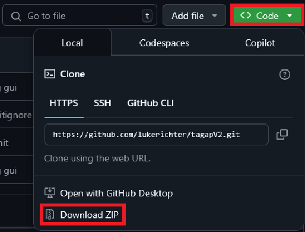
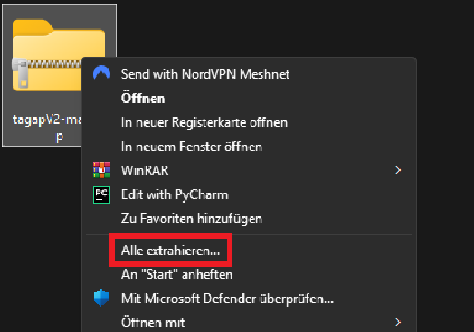

# tagapV2 - TAG Auswertungsprogramm

<h2> Beschreibung </h2>

Dieses Projekt ist ein Prototyp für eine Anwendung, die es ermöglicht, den TAG Test vollständig automatisiert
auszuwerten. Dazu ist es nur nötig, die gesammelten Daten in eine vorgegebene Tabelle (.csv) zu schreiben und den
Anweisungen zur Benutzung zu folgen. Das Programm wertet die Daten aus und gibt eine vollständig ausgewertete
Ergebnistabelle aus.

## Installation

<h3> 1. Installation von Python </h3>

Um das Programm starten zu können, müssen sie zuerst Python auf ihrem Rechner installieren. Dies ist notwendig, da das
Programm in Python geschrieben ist und daher eine Python-Umgebung benötigt.

Den Download finden Sie unter folgendem Link: [Download Python](https://www.python.org/downloads/).
> **Hinweis:** Wählen Sie die aktuellste Version (3.12.2
> oder neuer) aus und laden sie diese herunter. Achten Sie darauf, dass die richtige Version für ihr Betriebssystem
> auswählen.

 
<h3> 2. Installation des Programms </h3>

Nachdem Sie Python installiert haben, können Sie das Programm herunterladen.

- Dazu klicken Sie auf den grünen Button "Code" und wählen "Download ZIP" aus.
  

 

- Entpacken Sie die heruntergeladene Datei in einen Ordner ihrer Wahl. Klicken Sie dazu mit der rechten Maustaste auf
  die Datei und wählen Sie "All extrahieren" aus.
  

> **Hinweis:** Sie können auch ein anderes Programm verwenden, um die Datei zu
> entpacken. Hierzu können Sie z.B. 7zip oder WinRAR verwenden. Es reicht aber aus das Windows-Standardprogramm zu
> nutzen.

 
<h3> 3. Starten des Programms </h3>

Nachdem sie das Programm installiert haben, können Sie es starten. Dazu müssen Sie die Datei `start.py` im gerade
heruntergeladenen Ordner ausführen. Bitte lesen Sie anschließend die Erklärung unter dem Kapitel "Anwendung".

## Anwendung

Leider noch nicht verfügbar!

